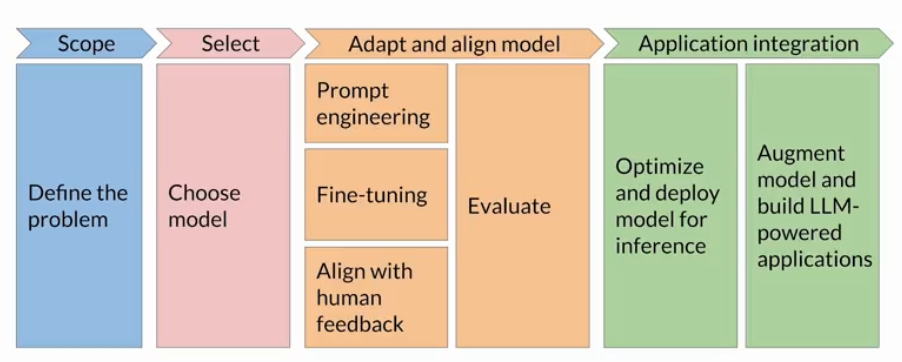

1) Customer Discovery - to generate customer problem solving - pain points

2) Planning - in this mode - is this do-able? feasibility analysis - proof of concept - 3 months tops/maximum - hit the market and get the data - cost/time/talent - tech stack 

3) Iterative Development - ai solution bit by bit . problem hypthoses - customer wanna pay for the product ? if yes you have a business in hand. 

    3.1)Proof of concept - bare minimum to get the idea across 
gather data and insight

    3.2)MVP - minimal features with maximum impact - improved features from POC
launch the mvp in the market

    3.3)Business product - robust , reliable, iterative release cycles - customer in the loop . full fledged features.

